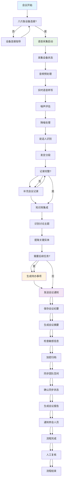

# 会议系统完整流程

以下样本覆盖设备连接循环、判断分支、中文节点和节点样式。

```mermaid
graph TB
    A[会议开始]
    B[八爪鱼设备连接?]
    C[设备连接指导]
    D[语音采集启动]
    E[采集设备状态]
    F[音频预处理]
    G[实时语音转写]
    H[噪声评估]
    I[降噪处理]
    J[说话人识别]
    K[发言分段]
    L[记录完整?]
    M[补充会议记录]
    N[知识库集成]
    O[识别讨论主题]
    P[提取关键实体]
    Q[需要后续任务?]
    R[生成待办事项]
    S[发送会议通知]
    T[保存会议纪要]
    U[生成会议摘要]
    V[检查敏感信息]
    W[加密归档]
    X[同步团队空间]
    Y[确认同步状态]
    Z[生成会议报告]
    AA[通知参会人员]
    AB[流程完成]
    AC[人工复核]
    AD[流程结束]
    A --> B
    B -->|否| C
    C --> B
    B -->|是| D
    D --> E
    E --> F
    F --> G
    G --> H
    H --> I
    I --> J
    J --> K
    K --> L
    L --> M
    M --> N
    N --> O
    O --> P
    P --> Q
    Q --> R
    R --> S
    S --> T
    T --> U
    U --> V
    V --> W
    W --> X
    X --> Y
    Y --> Z
    Z --> AA
    AA --> AB
    AB --> AC
    AC --> AD
    L -->|否| M
    M --> L
    L -->|是| N
    Q -->|是| R
    Q -->|否| S
    S --> T
    T --> U
    U --> V
    V --> W
    W --> X
    X --> Y
    Y --> Z
    Z --> AA
    AA --> AB
    AB --> AC
    AC --> AD
    style A fill:#e1f5fe
    style D fill:#e8f5e8
    style R fill:#fff3e0
    style S fill:#f3e5f5
```
